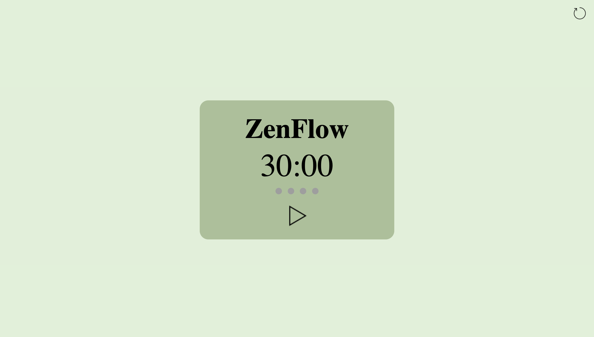

# ZenFlow

## 📝Project Description

Created a browser-based Pomodoro timer using HTML, CSS, and JavaScript, featuring
pause, resume, and reset functionality triggered by tab activity. Enhanced user
experience with visual notifications and progress indicators. Planned updates
to optimize tab-switching detection for improved timer reliability. Deployed
on GitHub Pages using Nvim and Git.

## 💡Key Features

- **interactive Animation** : A bird flying up and down on its way delivering a note
  that users can click on to proceed to read the letter
- **User Choices** : Two response options (yes/no) leading to different outcomes.
- **Dynamic Content** Integration with YouTube to play specific videos based on user responses.
- **Responsive Design** : Ensuring the website is visually appealing and functional across different devices.
- **Hosting** : Deployed using GitHub Pages for easy access and sharing.

## ⚙️ Technologies Used

- HTML
- CSS
- JavaScript
- GitHub Pages
- Git via terminal
- nvim editor

## 📹Demo

## 📷 Screenshots

Homepage of the pomodoro timer
